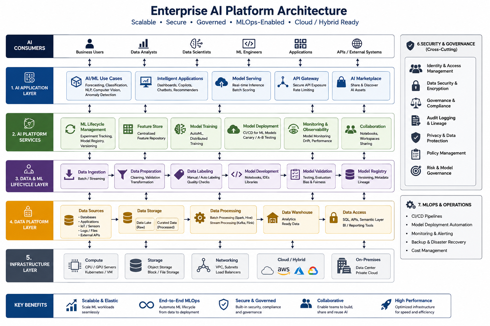

# ai-ml-infrastructure-platform
AI/ML Infrastructure, Data Platforms, Machine Learning Models, Enterprise AI Architecture, and AI Platform Implementation Portfolio.
======================================================================================================================================
# AI/ML Infrastructure Platform Portfolio

## Overview

This repository demonstrates enterprise AI and Machine Learning platform planning, infrastructure design, data platform architecture, model lifecycle management, security governance, and operational deployment practices.

The portfolio showcases documentation and implementation approaches for large-scale AI initiatives.

## Areas Covered

* AI Infrastructure
* Data Engineering Platforms
* Machine Learning Models
* AI Platform Architecture
* MLOps
* AI Governance
* AI Security
* Enterprise AI Adoption

## Technologies

* Python
* TensorFlow
* PyTorch
* Kubernetes
* Docker
* MLflow
* Apache Spark
* Hadoop
* PostgreSQL
* OpenSearch
* NVIDIA GPU Infrastructure

## Repository Structure

### AI Infrastructure

Infrastructure planning and deployment.

### Data Platform

Data ingestion, storage, processing, and analytics.

### ML Models

Model development and lifecycle management.

### AI Platform

Enterprise AI platform architecture.

### Security & Governance

Responsible AI and security controls.

### MLOps

Model deployment and operationalization.

## Author

BIZIMANA EMMANUEL

AI Infrastructure | Data Platform | Enterprise Technology

## AI Platform Architecture

